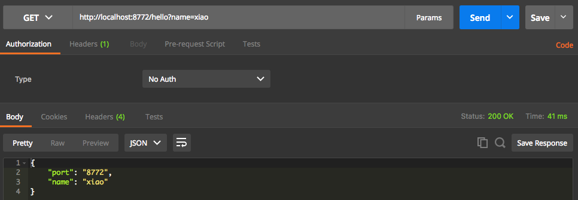

# 1.spring-cloud-eureka

## 1.1.说明

Eureka 是一个服务注册和发现模块。

先创建1个maven主工程，然后创建2个model工程。

* 一个model工程为服务注册中心（Eureka Server）
* 一个model工程为服务发布 (Eureka Client)。


## 1.2.Eureka Server

pom.xml

```xml
<dependency>
    <groupId>org.springframework.cloud</groupId>
    <artifactId>spring-cloud-starter-eureka-server</artifactId>
</dependency>
```

application.yml配置文件

```yaml
server:
  port: 8771

eureka:
  instance:
    hostname: localhost
  client:
    register-with-eureka: false
    fetch-registry: false
    service-url:
      defaultZone: http://${eureka.instance.hostname}:${server.port}/eureka/


```

## 1.3.启动Eureka Server

启动Eureka Server 工程，浏览器打开下面地址：

http://localhost:8771


## 1.4.Eureka Client

pom.xml


```xml
<dependency>
    <groupId>org.springframework.cloud</groupId>
    <artifactId>spring-cloud-starter-eureka</artifactId>
</dependency>

<dependency>
    <groupId>org.springframework.boot</groupId>
    <artifactId>spring-boot-starter-web</artifactId>
</dependency>
```

application.yml配置文件


```yaml
server:
  port: 8772
  
spring:
  application:
    name: service-app1
    
eureka:
  client:
    service-url:
      defaultZone: http://localhost:8771/eureka/

```

application启动类：

```java
@SpringBootApplication
@EnableEurekaClient
@RestController
public class ServiceApp1Application {

	public static void main(String[] args) {
		SpringApplication.run(ServiceApp1Application.class, args);
	}

	@Value("${server.port}")
	String port;

	@GetMapping("/hello")
	@ResponseBody
	public Map<String, String> hello(@RequestParam String name) {
		Map<String, String> result = new HashMap<>();
		result.put("name", name);
		result.put("port", port);
		return result;
	}
}

```

## 1.5.启动Eureka Client

启动Eureka Server,然后启动Eureka Client 工程，浏览器打开下面地址：

http://localhost:8771


http://localhost:8772/hello?name=xiao




